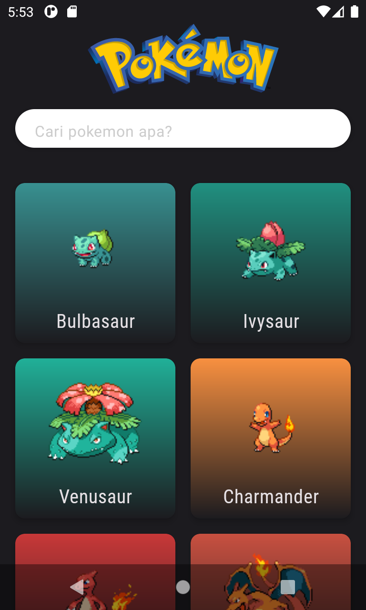
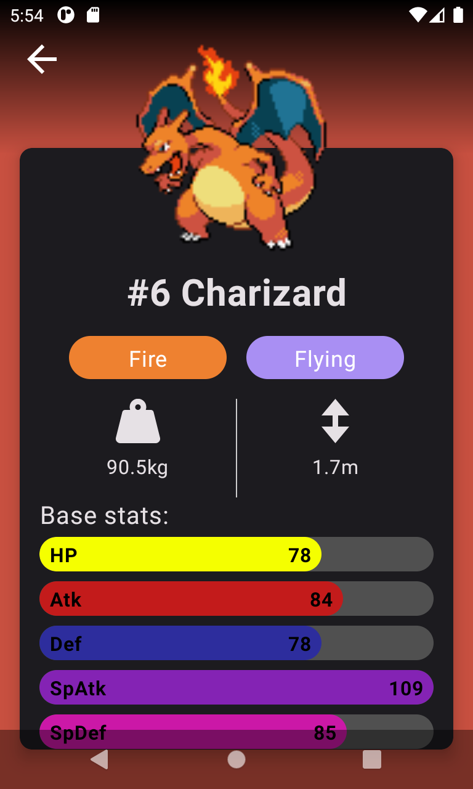

# Android MVVM Architecture - Pokedex App

`MVVM Architecture` is one of the most popular architectur to develop an app. MVVM architectural pattern divides an application into three key components: Model, View, and ViewModel. Model: This is your business logic and data. Here, you process data, perform operations, and interact with data sources. View: This is the User Interface (UI). ViewModel: Acts as a mediator between the model and view.
This `Pokedex` Android App i build using `kotlin` and `jetpack compose`. I use `Retrofit` for network calling library, `Dagger-hilt` for dependency Injection.

  

## Prerequisites

Basic Kotlin and Jetpack Compose, knowledge of `HTTP` request by Retrofit library and dagger-hilt for `dependency injection` are required for this project.

## Project Description

I build a Pokedex Application with MVVM Architecture. The UI will be as like as above screenshot. There is a `SearchBar` where you can search what pokemon you want to see. If you click one of the pokemon the app will send `request` to Poke API to get the detail of the pokemon like what type, height and weight.

## Poke API

I use [Poke API](https://pokeapi.co/) for getting detail information of pokemon. Poke API is only the HTTP GET method is available on resources. `No authentication` is required to access this API, and all resources are fully open and available.

## Libraries 

* [Coil](https://coil-kt.github.io/coil/compose/) for Image Loader
* [Retrofit](https://github.com/square/retrofit) for HTTP Request
* [Dagger/Hilt](https://github.com/google/dagger/releases) for Dependency Injection
* [Kapt](https://kotlinlang.org/docs/kapt.html) for Annotation Processors

## Run Project

This project was build on JDK 1.8. Sync the `Gradle` and run the project. Install APK on your emulator or real device. Dont forget to turn on the internet of your device so the application can access the `Poke API`.
